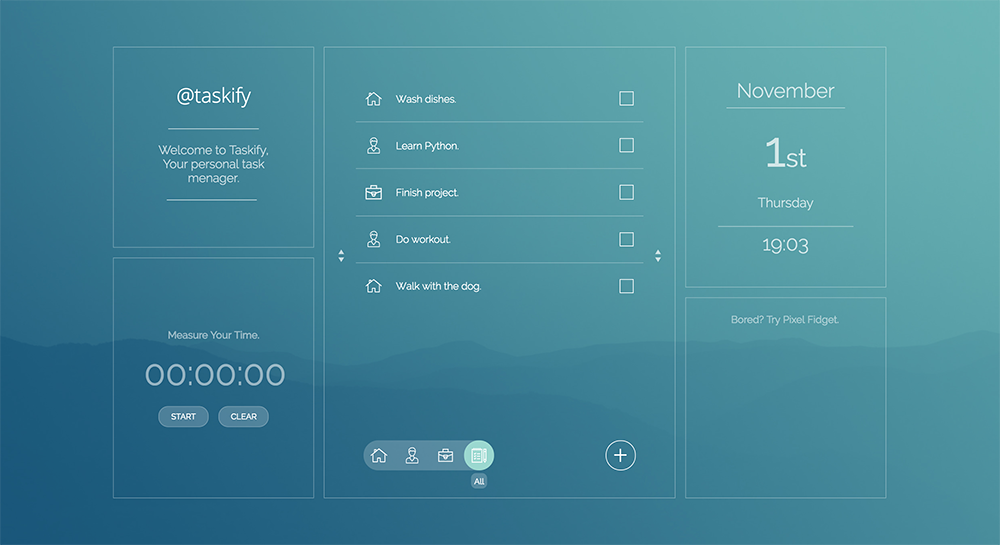

taskify - menage your tasks easly
---------------------------------
https://piotrthread.github.io/taskify/ 
Final Project for Coderslab.  

It’s a simple task menager build with React.js and Firebase API for database storing. 
Desktop & mobile version is available. 
You can ADD | REMOVE | FILTER tasks in three groups. 
It has additional widgets: Date & Time, Stopwatch,Pixel Fidget.  

Used technologies: 
HTML, SCSS, React.js, ES2015, Webpack, Firebase for backend database, fetch() API.   
  
  
  
